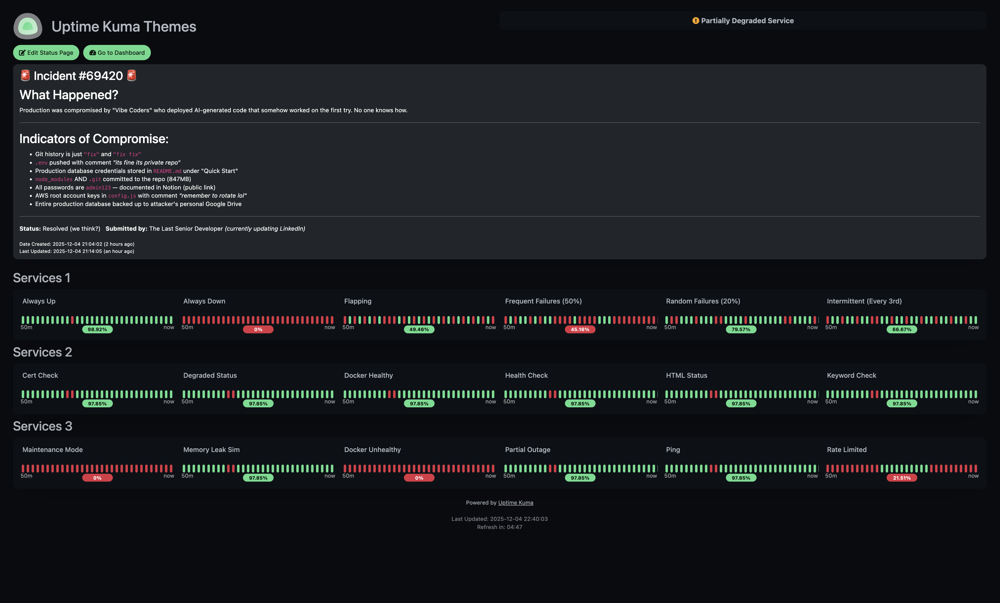
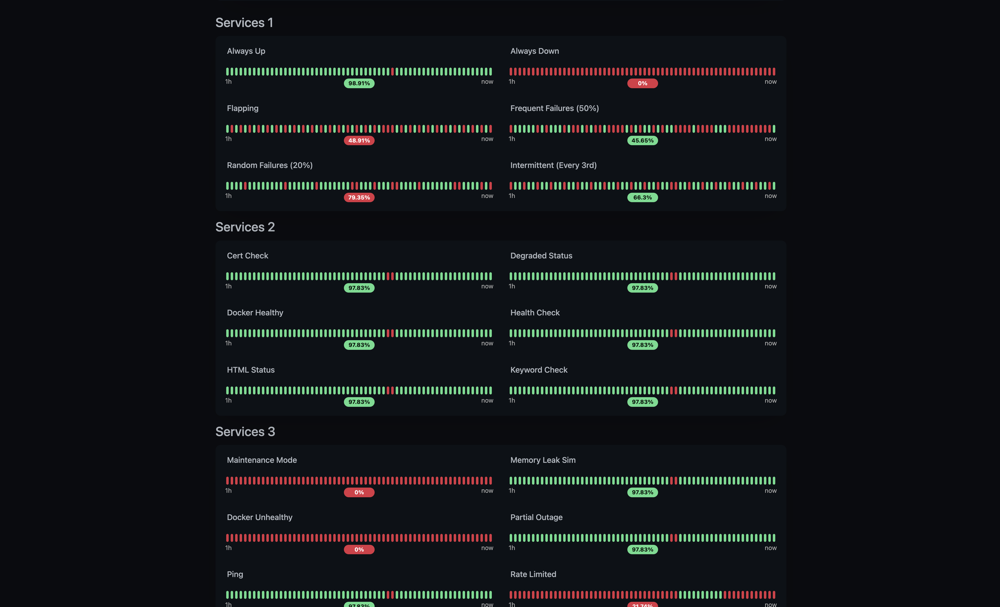
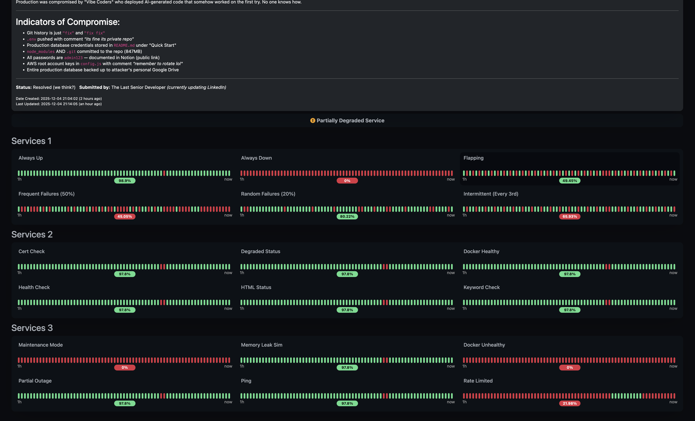
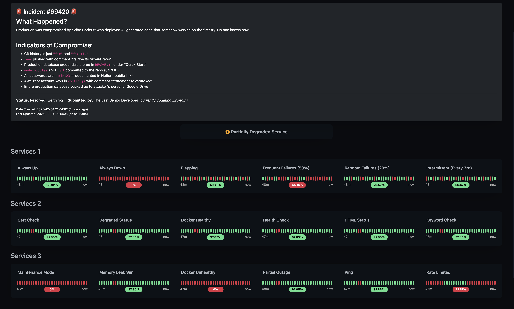
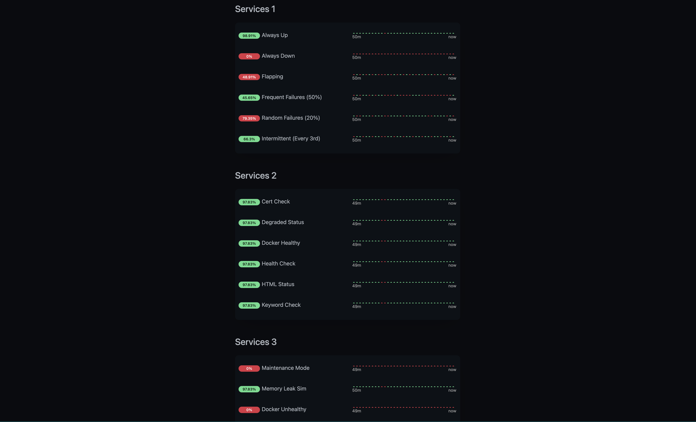
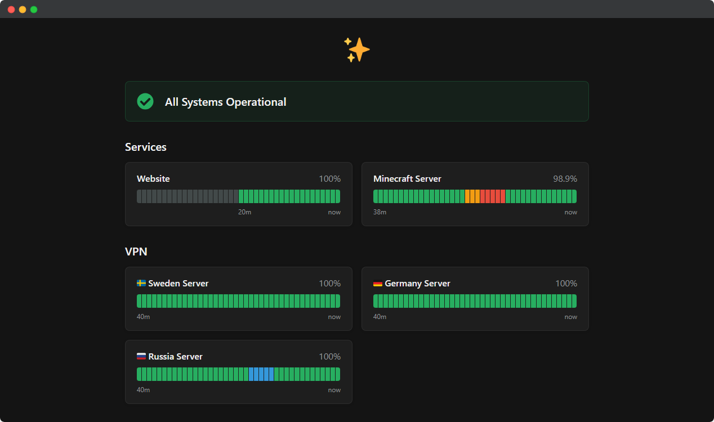

# Uptime Kuma Themes

[](https://opensource.org/licenses/MIT)
[](https://bun.sh)
[](https://www.typescriptlang.org/)
[](https://www.docker.com/)
[](https://github.com/louislam/uptime-kuma)

A collection of beautiful, customizable themes and layouts for [Uptime Kuma](https://github.com/louislam/uptime-kuma) status pages.

---

## Table of Contents

- [Usage](#usage)
- [Layouts](#layouts)
- [Themes](#themes)
- [Documentation](#documentation)
- [License](#license)
- [Acknowledgments](#acknowledgments)

---

## Usage

### Applying a Theme or Layout

1. Open your Uptime Kuma dashboard
2. Go to **Status Pages** and select a status page
3. Click the **Edit Status Page** button
4. Scroll down to the **Custom CSS** section
5. Copy the contents of your chosen theme from `themes/<theme-name>/index.css` or layout from `layouts/<layout-name>/index.css`
6. Paste it into the Custom CSS field
7. Save

### Combining Theme + Layout

You can combine any theme with any layout by concatenating both CSS files:

```css
/* First, paste the theme CSS */
/* themes/dracula/index.css content here */

/* Then, paste the layout CSS */
/* layouts/two-column/index.css content here */
```

---

## Layouts

- Layouts
  - [Compact](#compact)
  - [Two-Column](#two-column)
  - [Three-Column](#three-column)
  - [Cards Grid](#cards-grid)
  - [Minimal](#minimal)

---

### Compact

Dense, space-efficient layout for many monitors. Auto-fit grid with minimal padding.



[View CSS](./layouts/compact/index.css)

---

### Two-Column

Side-by-side monitor display. Forces exactly 2 columns on larger screens.



[View CSS](./layouts/two-column/index.css)

---

### Three-Column

Maximum density grid layout. Forces 3 columns on large screens, 2 on medium.



[View CSS](./layouts/three-column/index.css)

---

### Cards Grid

Individual monitors as responsive cards. Auto-fit grid with centered content.



[View CSS](./layouts/cards-grid/index.css)

---

### Minimal

Clean, distraction-free design. Narrow container with thin heartbeat bars.



[View CSS](./layouts/minimal/index.css)

---

## Themes

- Themes
  - [Lumina](#lumina)
  - [Ayu](#ayu)
  - [Catppuccin](#catppuccin)
  - [Solarized](#solarized)
  - [Gruvbox](#gruvbox)
  - [Nord](#nord)
  - [Dracula](#dracula)
  - [Tokyo Night](#tokyo-night)
  - [One Dark Pro](#one-dark-pro)
  - [Monokai](#monokai)
  - [Palenight](#palenight)
  - [Synthwave '84](#synthwave-84)
  - [Everforest](#everforest)
  - [Kanagawa](#kanagawa)
  - [Rosé Pine](#rosé-pine)
  - [Modus Vivendi](#modus-vivendi)
  - [GitHub Dark](#github-dark)
  - [Night Owl](#night-owl)
  - [Horizon](#horizon)
  - [One Light](#one-light)
  - [Moonlight](#moonlight)
  - [Cute Kuma](#cute-kuma)

---

### Lumina

Dark cinematic theme with orange accents.


[View CSS](./themes/lumina/index.css)

---

### Ayu

Minimalist with soft, refined colors.


[View CSS](./themes/ayu/index.css)

---

### Catppuccin

Soothing pastel theme (Mocha flavor).


[View CSS](./themes/catppuccin/index.css)

---

### Solarized

Precision-engineered dark color scheme.


[View CSS](./themes/solarized/index.css)

---

### Gruvbox

Retro groove with warm browns, oranges, and muted greens.


[View CSS](./themes/gruvbox/index.css)

---

### Nord

Arctic, bluish-grey inspired by polar nights.


[View CSS](./themes/nord/index.css)

---

### Dracula

Dark purple with vibrant pink, cyan, and green accents.


[View CSS](./themes/dracula/index.css)

---

### Tokyo Night

Deep blues inspired by Tokyo city lights.


[View CSS](./themes/tokyo-night/index.css)

---

### One Dark Pro

Based on Atom's iconic One Dark theme.


[View CSS](./themes/one-dark-pro/index.css)

---

### Monokai

The legendary Sublime Text classic.


[View CSS](./themes/monokai/index.css)

---

### Palenight

Material Design-inspired purples and teals.


[View CSS](./themes/palenight/index.css)

---

### Synthwave '84

Retro 80s neon aesthetic with glow effects.


[View CSS](./themes/synthwave-84/index.css)

---

### Everforest

Nature-inspired green palette.


[View CSS](./themes/everforest/index.css)

---

### Kanagawa

Japanese-aesthetic muted tones.


[View CSS](./themes/kanagawa/index.css)

---

### Rosé Pine

Soft, romantic, muted tones.


[View CSS](./themes/rose-pine/index.css)

---

### Modus Vivendi

WCAG AAA accessible dark theme.


[View CSS](./themes/modus-vivendi/index.css)

---

### GitHub Dark

Official GitHub dark colors.


[View CSS](./themes/github-dark/index.css)

---

### Night Owl

Optimized for night-time with accessible colors.


[View CSS](./themes/night-owl/index.css)

---

### Horizon

Warm oranges, purples, and pinks.


[View CSS](./themes/horizon/index.css)

---

### One Light

Clean, professional light theme.


[View CSS](./themes/one-light/index.css)

---

### Moonlight

Deep blues with vibrant accents.


[View CSS](./themes/moonlight/index.css)

---

### Cute Kuma

Uses design elements found in Shadcn based UI libraries.



[View CSS](./themes/cute-kuma/index.css)

---

## Documentation

- [Development Guide](./docs/DEVELOPMENT.md) - Setting up the development environment, available scripts, mock server endpoints, and troubleshooting
- [Contributing Guide](./docs/CONTRIBUTING.md) - How to add new themes/layouts, code style guidelines, and PR requirements

## License

MIT License - feel free to use these themes in your own projects!

## Acknowledgments

- [Uptime Kuma](https://github.com/louislam/uptime-kuma) by Louis Lam
- [brooksvb](https://github.com/brooksvb) For reference code on the layouts on this [gist](https://gist.github.com/brooksvb/78a54355151a18477e33c224177dc5fa)
- Theme color palettes from their respective projects:
  - [Gruvbox](https://github.com/morhetz/gruvbox)
  - [Catppuccin](https://github.com/catppuccin/catppuccin)
  - [Nord](https://www.nordtheme.com)
  - [Dracula](https://draculatheme.com)
  - [And more...](#themes)
